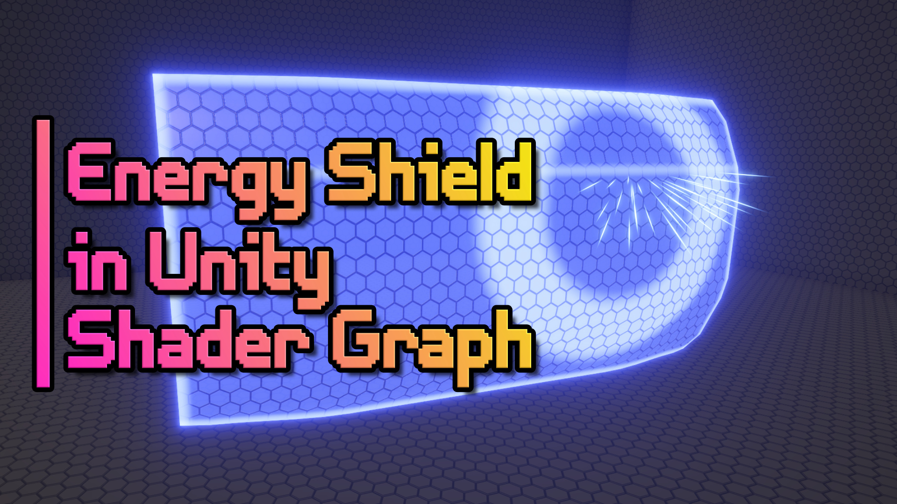

# Energy Shield Hologram in Unity Shader Graph

A stylised energy shield shader effect (with additional VFX).

## Overview

This shader project features a single Shader Graph with modular parts, allowing you to create a shield hologram with all the features, or turn some off if you want a less expensive shader! Featuring edge glow with object intersections, two types of scanline, emissive surface glow, and a ripple effect at a raycast point (driven by a script which is also included). A VFX effect is also fired at the impact point.

## Software

This project was created using Unity 2021.3.0f1 (LTS) and URP 12.1.6.

## Tutorials

A tutorial video will be available on YouTube based on this project.

## Authors

This project and the corresponding tutorials were created by Daniel Ilett.

## Release

This project was released on February 9th 2023.
